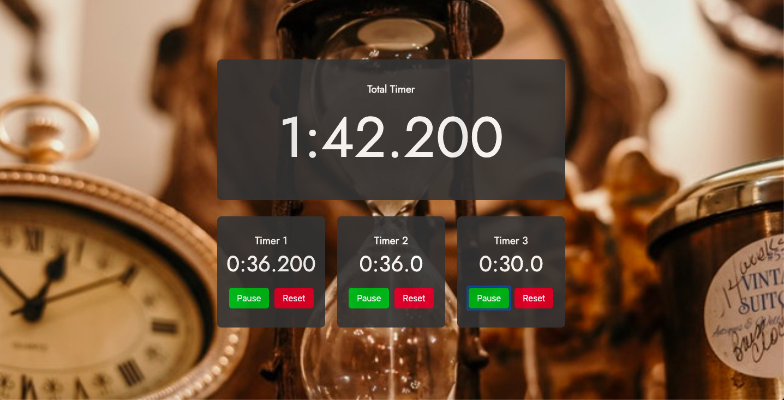

A Convoluted Timer written in ReactJs using React Hooks

- Three individual timers that increment at different time intervals
- A total timer shows the sum of all timers at any point in time
- All timers display the time in the format mm:ss.ttt (m = minute, s = second, t = millisecond)
- Timer 1 increments every 0.1 seconds
- Timer 2 increments every 1 second
- Timer 3 increments every 10 seconds
- Individual timers can be Played, Paused or Reset separately, which reflects in the total timer
- Uses React Hooks (useState) for state management
- Designed to be Responsive for mobile & tablets
